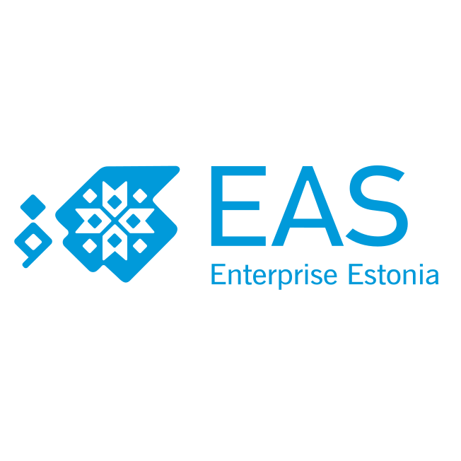

&nbsp;&nbsp;&nbsp;&nbsp;&nbsp;

&nbsp;&nbsp;&nbsp;&nbsp;&nbsp;

&nbsp;&nbsp;&nbsp;&nbsp;&nbsp;

&nbsp;&nbsp;&nbsp;&nbsp;&nbsp;

## Ranger

This is an execution runtime project for the cyber range. It's main purpose is to coordinate deployment of SDL-based scenario in live environment.

### Developing

Use VSCode and [devcontainers](https://code.visualstudio.com/docs/remote/containers) to develop ranger and automatically have its dependencies deployed.
The vSphere related dependencies (docker containers) require network access from the users system to vSphere, this may require logging into appropriate VPN's.

Use `cargo install cargo-insta` to have access to snapshot tooling under `cargo insta` command.

Use `cargo install diesel_cli` to have access to database management (setup, migrations, etc.) under `diesel` command.

#### Setup

Before opening the folder in `devcontainer` configurations for dependency services need to be filled out. To get the apporiate list of configurations consult either `.gitignore` or `.devcontainer/docker-compose.yml` files.

##### Keycloak

Users for the development keycloak server are:

 | Username | Password    |
 | :---: | :---: |
 | test   | Testimine.123   |
 | admin   | admin   |
 | participant   | participant   |
 | manager   | manager   |
 | client   | client   |

Test exercise users are:

 | Username | Password    |
 | :---: | :---: |
 | noormeister   | noormeister   |
 | noormeister1   | noormeister1   |
 | noormeister2   | noormeister2   |

To add new values to realm permanently follow these steps:

1. Make changes in the current realm

2. Commit development keycloak docker container

`docker commit [container-id] intermediate-keycloak`

3. Stop development keycloak docker container

`docker container stop [container-id]`

4. Run the itermediate container

`docker run -ti -v path-to-any-existing-file.json:/opt/keycloak/data/import/testrealm.json --entrypoint=sh intermediate-keycloak`

5. In container move to bin directory

`cd /opt/keycloak/bin/`

6. Run the import command

`./kc.sh export --realm OCR --file ./realm-export.json`

7.  While itermediate container is still running, run `cp` on the host machine

`docker cp [container-id]:/opt/keycloak/bin/realm-export.json ./`

8. Finally replace the realm export file with the existing realm file, which is located in repo at `/.devcontainer/configs/keycloak-realm.json`
